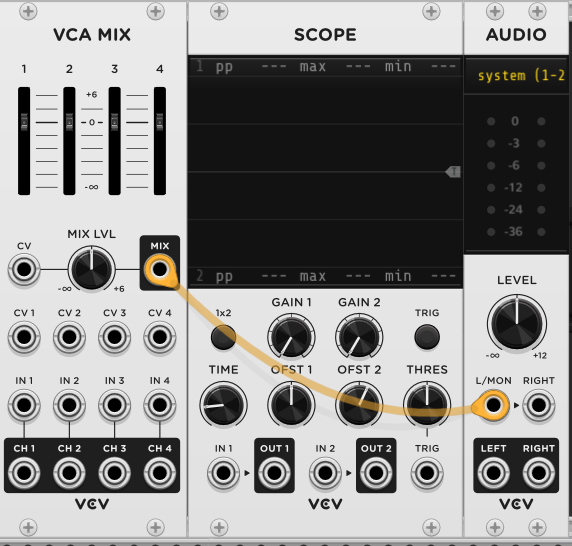
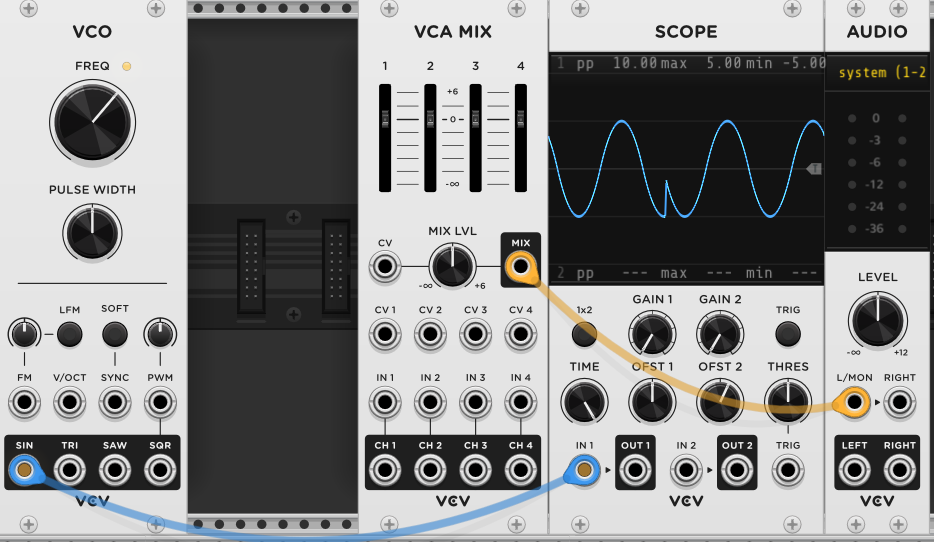
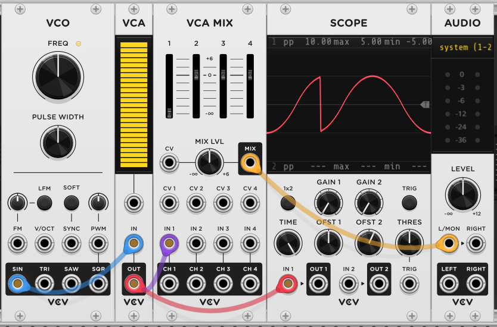
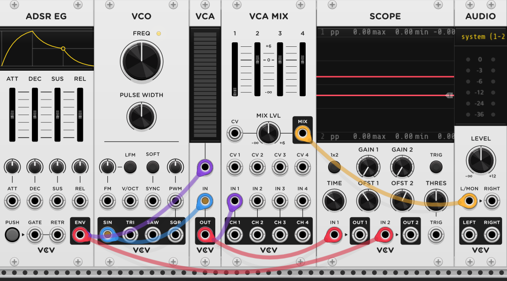

# CV e manipolazione dei parametri del suono

## Tabella dei contenuti

1. [Introduzione](#introduzione)
2. [CV e manipolazione dei parametri del suono](#cv-e-manipolazione-dei-parametri-del-suono)
   - [Control Voltage, controllo dei parametri](#control-voltage-controllo-dei-parametri)
   - [Breve setup di VCV](#breve-setup-di-vcv)
   - [Primi moduli](#primi-moduli)
     - [Oscillatore](#oscillatore)
   - [Usiamo il Control Voltage!](#usiamo-il-control-voltage)

## Control Voltage, controllo dei parametri

I suoni sono una delle cose che immediatamente ci viene in mente se cerchiamo di indovinare cosa passa attraverso i cavi di un sintetizztore modulare! Tuttavia, in quasi tutti i cavi patch di un modulare la maggior parte di questi saranno attraversati dal Control Voltage. Come si fa a controllare cosa fanno questi sintetizzatori? Il control voltage serve proprio a questo. Quando guardiamo tutti i pannelli di un sintetizzatore vediamo come questi abbiano molte manopole o 'knob' che ne gestiscono il parametro. Possiamo immaginare il CV (control voltage) come una mano invisibile che gira e gestisce le manopole per noi. Facciamo qualche esempio pratico! 

Tutti gli esempi che affronteremo ora sono dei concetti con cui si può familiarizzare interattivamente anche su [https://learningsynths.ableton.com/](https://learningsynths.ableton.com/) una incredibile risorsa sul funzionamento dei sintetizzatori sul sito di Ableton, una famosa e utilizzatissima DAW. Per quanto non sia riferita ai sintetizzatori modulari, i concetti trattati sono assolutamente gli stessi. 

Se invece hai precedentemente scaricato VCV Rack, o ti trovi davanti a un sintetizzatore modulare, iniziamo a provare! 

### Breve setup di VCV 

Apriamo insieme VCV Rack! La schermata iniziale ti mostrerà dei tip iniziali ed avrai una patch già iniziata davanti a te. Sentiti libero di leggere i tip prima di iniziare, ma ti consiglio di togliere tutti i moduli e lasciare solamente i moduli:

- Audio: questo sarà l'ultimo modulo raggiunto dalla nostra patch, da qui esce l'audio che poi uscirà dalle casse del computer o dalle cuffie. Potrai selezionare il driver audio: se hai una scheda audio seleziona il driver ASIO della tua scheda, altrimenti il primo driver che trovi funzionerà perfettamente. 
- Scope: questo modulo non emette nessun suono ma ci permette di visualizzare i segnali su un grafico! È uno strumento estremamente potente che ci da la possibilità di capire cosa stiamo facendo e che segnali stiamo creando e stiamo dando in pasto ai moduli. 
- VCA Mix: Un mixer a quattro canali. Per ora lo useremo solamente come Mixer, non ti preoccupare della parte Voltage control. Il mixer ha 4 entrate ed un'uscita, collega l'uscita del mix al Left dell'audio.

Questi sono i moduli utility, ora iniziamo a fare qualche suono e a capire cos'è il control voltage! Avranno più o meno questo aspetto:

Una nota importante, vediamo come tutti i moduli hanno tendenzialmente quattro tipi di componenti:
- gli input, rappresentati dai buchi non circondati di nero: in questi punti il segnale entra
- gli output, rappresentati dai buchi circondati di nero: in questi punti il segnale esce
- i parametri, rappresentati da knob, sliders o bottoni. non ci si può collegare fisicamente niente (anche se spesso i parametri sono appunto controllabili tramite CV) ma servono all'utente per interagire con il parametro manualmente

Per collegare un input a un output basta cliccare sull'input e trascinare il cavo che si viene a creare fino all'output. Il software non permette di collegare due input o due output. Ora possiamo iniziare a patchare. 

### Primi moduli 

Come abbiamo detto nel paragrafo precedente, il control voltage è come se fosse una piccola mano che cambia i valori delle manopole. Iniziamo a mettere i primi moduli su VCV e a guardare quali sono i parametri che possiamo muovere con il CV 

#### Oscillatore

Iniziamo mettendo un oscillatore! Possiamo definirli il cuore di un sintetizzatore, poiché, appunto, oscillano, oscillando creano un'onda e quindi un suono! Cliccando con il tasto destro su uno spazio vuoto possiamo accedere alla libreria di VCV. Cerchiamo un oscillatore e clicchiamoci con il sinistro. Ora il nostro VCO è nel nostro rack! Colleghiamo il suo output 'sin' (un'onda seno) all'input dello scope, diminuiamo il frame di tempo dello scope (portando il knob time tutto a destra) e osserviamo

È l'onda seno di cui abbiamo parlato nel primo capitolo! prendiamo ora un voltage controlled ampliefier e iniziamo a interagire con i concetti base di ampiezza e frequenza che abbiamo visto nel primo capitolo. 
- Aggiungiamo un VCA
- Colleghiamo il VCO all'input del VCA
- Abbassiamo il volume del mixer tramite lo slider
- Colleghiamo l'output del VCA allo scope e al Mixer

Ti consiglio di abbassare il volume per evitare di attaccare di botto! Il tuo rack avrà ora questo aspetto

Ora possiamo interagire con la frequenza e l'ampiezza dell'onda! Se alzi un poco il volume dal mixer potrai sentire l'onda seno: è un'onda pura, c'è solo l'armonica fondamentale agli hertz che puoi vedere hoverando il mouse sul grande knob della frequenza. Muovendo Il knob della frequenza vedrai sullo scope che le onde si allargano o si stringono, e sentirai come il suono diventa più grave o più acuto! Allo stesso tempo, il VCA è l'amplificatore, che gestisce il volume o l'ampiezza dell'onda. Abbassandolo o alzandolo vedrai come l'onda diventa più o meno alta e il volume farà la stessa cosa. 

## Usiamo il Control Voltage! 

Ora che abbiamo un oscillatore, perché non controllarlo senza muovere i parametri manualmente? È qui che entra in gioco il control voltage! Aggiungiamo un modulo ADSR, anche chiamato Envelope o inviluppo.

ADSR sta per Attack - Decay - Sustain - Release. Di fatto questo modulo è un generatore di onde, e ADSR sono i parametri che puoi gestire dell'onda:

- attack: quanto tempo ci vuole all'onda per raggiungere il suo picco
- decay: quanto tempo ci vuole all'onda per raggiungere il suo stato neutro dopo il picco
- sustain: quanto è il volume dello stato neutro 
- release: quanto tempo l'onda ci mette per tornare a zero

Possiamo collegare l'ADSR allo scope per dargli un'occhiata! Vediamo appunto come nello scope l'onda si comporta esattamente com'è graficamente rappresentata. Quest'onda può essere usata come control voltage, dobbiamo solo indirizzarla! Usiamo per controllare il volume, e colleghiamolo al CV input del VCA. 

Adesso, se clicchiamo su push (che triggera l'onda) vediamo come il volume, l'ampiezza del nostro oscillatore segue l'andamento dell'onda che abbiamo creato! Possiamo giocare un po' con le impostazione dell'envelope ed ottenere diversi risultati. 

Possiamo controllare altre cose oltre al volume! Proviamo a controllare la frequenza dell'oscillatore: prendiamo l'output dell'envelope e colleghiamo all'input v/oct (l'input della frequenza) del VCO. Vediamo adesso come il suono abbia un pitch molto alto appena premiamo per poi abbassarsi immediatamente, molto simile a come ci immaginiamo i suoni dei laser nella cultura pop!

Ora che abbiamo capito le basi del control voltage, nel prossimo capitolo iniziamo a costruire un sintetizzatore più complesso, e conosceremo qualche modulo nuovo. 